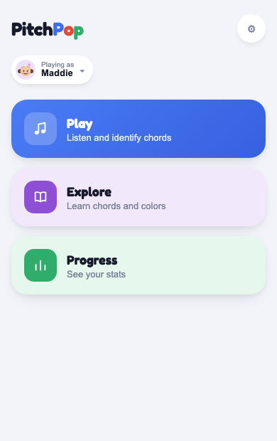
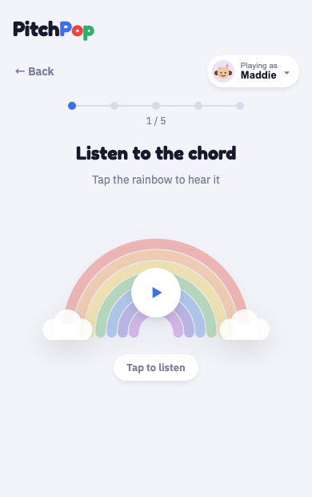
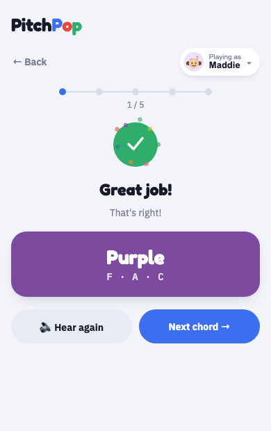

# PitchPop

We have a game we play: I play a chord on the piano, and my kids have to grab the matching color flag and shout it out. C-E-G is red, A-C-F is black, B-D-G is blue, and so on through nine chords.

Live at **[marikalam.github.io/games/pitchpop](https://marikalam.github.io/games/pitchpop/)**, alongside [the other games](https://marikalam.github.io/games/). (The old `/pitchpop/` link still works — it just redirects here.)

## What it looks like

  

The home screen has three things to do, picked from a "Playing as [avatar] ▾" switcher that follows you into every screen:

- **Play** — the actual quiz. Tap the rainbow to hear a chord, pick which color you think it was from four options, and get feedback (confetti and "Great job!" if right; the correct answer shown if not). A "Hear again" link from either result takes you to a re-listen screen with a "Choose a different answer" link back to the same question, so a wrong guess turns into another listen-and-try rather than a dead end. Five chords per round; Maddie draws from all nine colors, Marcus from the six he's working on (black, blue, red, yellow, green, orange). At the end, "Play again" starts a fresh shuffled set.
- **Explore** — the original free-play grid: tap any of the nine pads to hear its chord, no quiz attached.
- **Progress** — a running per-kid record (saved on the device, so it survives closing the app): total chords answered, overall accuracy, and a breakdown of how many times each color has come up.

## Running it

```
npm install
npm run dev
```

Add it to your phone's home screen from the browser (Share → Add to Home Screen on iPhone) and it behaves like a real app — full screen, one tap, no browser chrome.

## Why the notes are in that order

`src/piano.js` always treats the first letter in a color's note list as the one that goes on the bottom, and stacks the rest upward from there. Black's A is the lowest note in the whole app; red's C sits on middle C. If you ever add a color, that's the rule to follow.

The "piano" sound isn't a sample — it's synthesized (a handful of harmonics per note plus a bit of hammer noise and reverb) to get closer to a real piano without shipping actual audio files.
