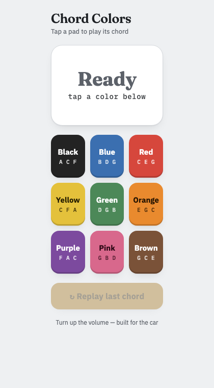
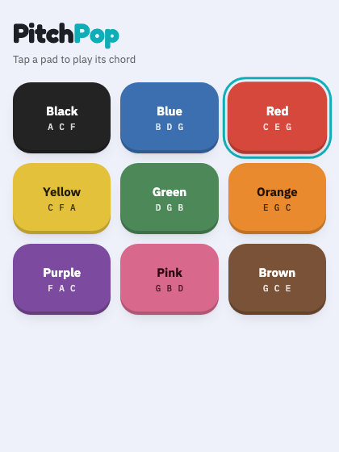

# Chord Colors

We have a game we play: I play a chord on the piano, and my kids have to grab the matching color flag and shout it out. C-E-G is red, A-C-F is black, B-D-G is blue, and so on through nine chords.

Nine buttons, one per color, each one plays the right chord. Tap red, it plays C-E-G. That's the whole app.

## What it looks like

 

Tap a pad and the panel up top fills with that color and shows what's playing.

## Running it

```
npm install
npm run dev
```

Add it to your phone's home screen from the browser (Share → Add to Home Screen on iPhone) and it behaves like a real app — full screen, one tap, no browser chrome.

## Why the notes are in that order

`src/piano.js` always treats the first letter in a color's note list as the one that goes on the bottom, and stacks the rest upward from there. Black's A is the lowest note in the whole app; red's C sits on middle C. If you ever add a color, that's the rule to follow.

The "piano" sound isn't a sample — it's synthesized (a handful of harmonics per note plus a bit of hammer noise and reverb) to get closer to a real piano without shipping actual audio files.
